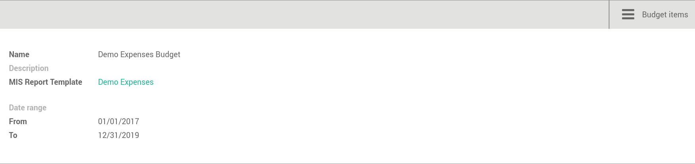

MIS Budget
----------
This module lets you create budgets for any MIS report. Several budgets can be created
for a given report template (ie one budget per year). Budget figures are provided at the
KPI level, with different time periods. A budget can then be selected as a data source
for a MIS report column, and the report will show the budgeted values for each KPI,
adjusted for the period of the column.

.. image:: images/05.png
   :width: 1800
