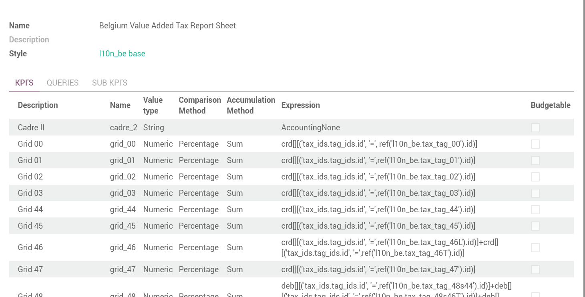

Reports Examples
----------------
The module `mis_builder_demo <https://github.com/OCA/mis-builder/tree/10.0/mis_builder_demo>`_ provides multiple example along with the current existing localizations

Trial Balance (sub-KPI)
***********************
.. image:: images/17.png
   :width: 1800

.. image:: images/18.png
   :width: 1800

Alternative Series
******************
Check the module `mis_builder_demo <https://github.com/OCA/mis-builder/tree/10.0/mis_builder_demo>`_ to see how to create specific series of data for Committed purchases not yet invoiced.

Localization
************
Multiple localizations are currently using the MIS Builder module as a base for their standard reporting. Examples of the reports can be studied here:

* `Belgium <https://github.com/OCA/l10n-belgium>`_
* `France <https://github.com/OCA/l10n-france>`_
* `Luxembourg <https://github.com/OCA/l10n-luxemburg>`_
* `Spain <https://github.com/CA/l10n-spain>`_

Belgium P&L
###########
.. image:: images/19.png
   :width: 1800

Belgium Balance Sheet
#####################

Belgium VAT report
##################

.. image:: images/22.png
   :width: 1800

Spain Balance Sheet
###################

Spain P&L
#########
.. image:: images/24.png
   :width: 1800