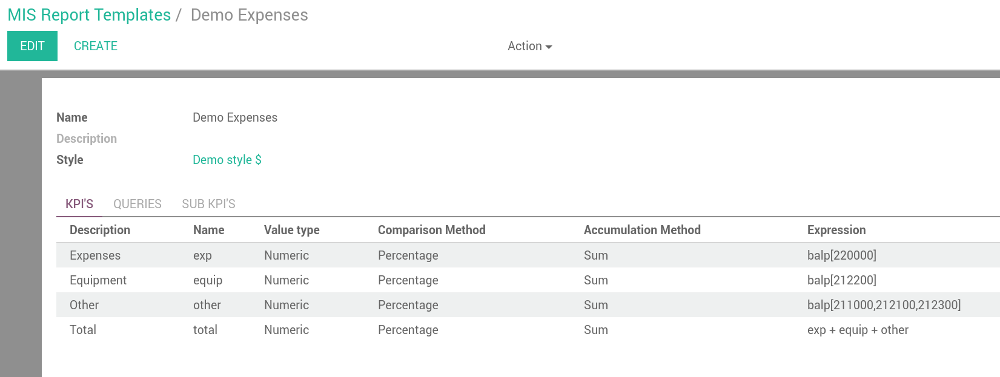
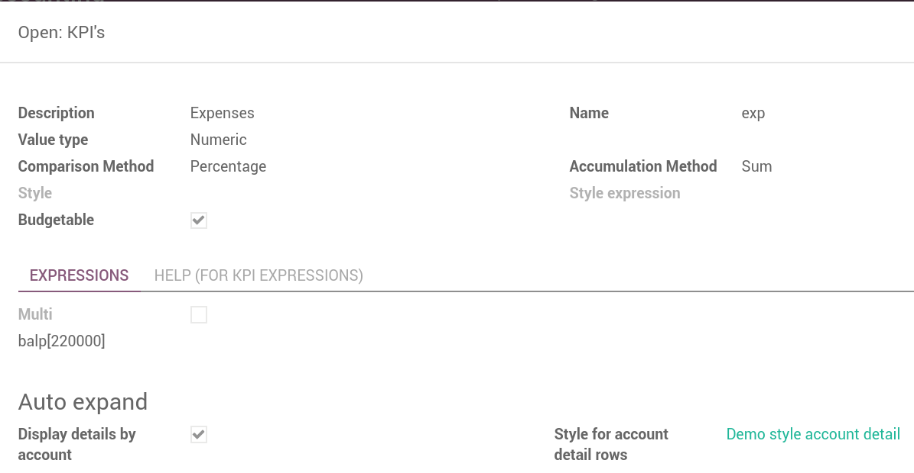
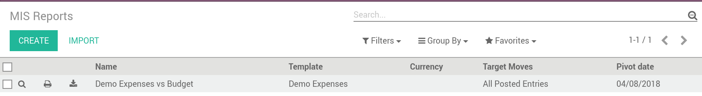
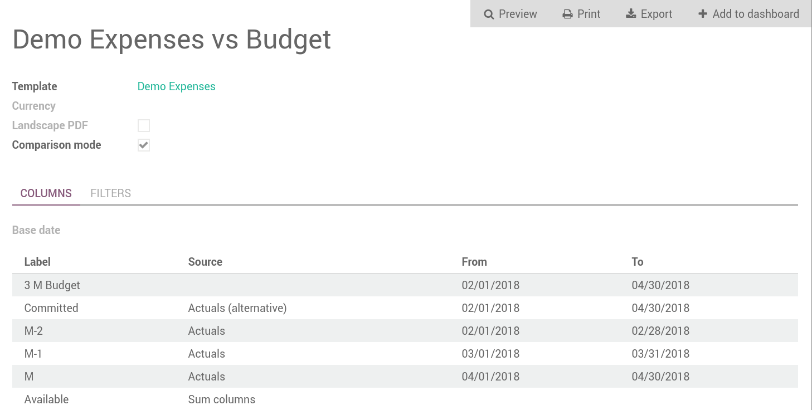
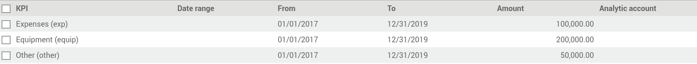
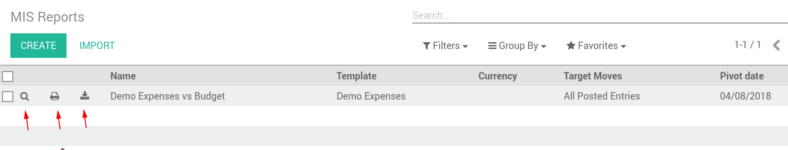
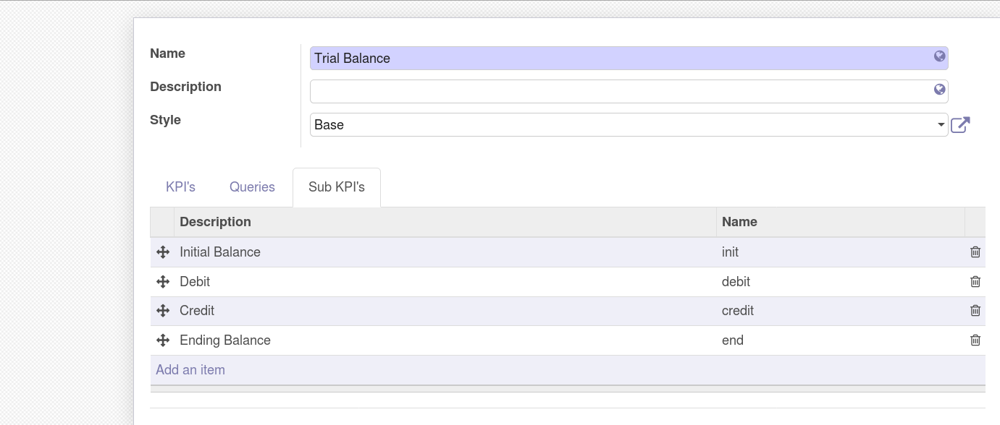
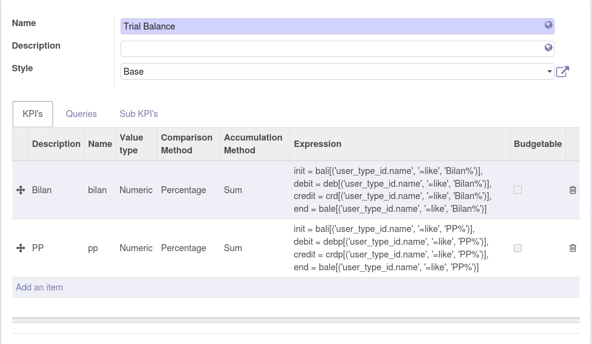

Creating New reports
====================
Create Styles for your reporting
********************************
Menu accessible here: `Accounting > Configuration > MIS Reporting > MIS Reports Style`

You can create multi-level styles which will be applied to the different lines of reporting:

The styles are used later in the Template Report definition.

Create a Template Report
************************
Menu accessible here: `Accounting > Configuration > MIS Reporting > MIS Reports Template`

Templates are the base of the reports, defining the KPI structure and calculation
between the elements. They can be found in:

How to create a template
########################
#. Provide a Description (Name is automatically proposed but can be amended)
#. Value type (Numeric, percentage or string)
#. Comparison Method (Percentage, difference, none)
#. Style: as defined in the Reports Style
#. Style expression: An expression that returns a style depending on the KPI value.
   Such style is applied on top of the row style.
#. Budgetable (if MIS_Budget module is installed): indicates that a budget can be
   provided for the KPI (not needed for calculations)
#. Multi: If True allows to define KPI with multiple values (eg: Initial, Debit,
   Credit, Ending) using Sub-KPI
#. Expression: calculation for the KPI (see below)
#. Display details by account: If set to true will display account details
#. Style for account detail rows: specific style applied to the detailed accounts.

Adding KPI to the current report
################################
KPI are the different element that constitutes the template:

KPI details:

Help for the KPI
----------------
Expressions can be any valid python expressions.

The following special elements are recognized in the expressions to compute accounting
data: {bal|crd|deb}{pieu}[account selecor][journal items domain].

* bal, crd, deb: balance, debit, credit.
* p, i, e: respectivelyl variation over the period, initial balance, ending balance
* The account selector is a like expression on the account code (eg 70%, etc).
* The journal items domain is an Odoo domain filter on journal items.
* balu[]: (u for unallocated) is a special expression that shows the unallocated 
  profit/loss of previous fiscal years.
* Expression can also involve other KPI and query results by name (eg kpi1 + kpi2).

Additionally following variables are available in the evaluation context:

* sum, min, max, len, avg: behave as expected, very similar to the python builtins.
* datetime, datetime, dateutil: the python modules.
* date_from, date_to: beginning and end date of the period.
* AccountingNone: a null value that behaves as 0 in arithmetic operations.

Examples for the KPI
--------------------
* bal[70]: variation of the balance of account 70 over the period (it is the same as balp[70].
* bali[70,60]: initial balance of accounts 70 and 60.
* bale[1%]: balance of accounts starting with 1 at end of period.
* crdp[40%]: sum of all credits on accounts starting with 40 during the period.
* debp[55%][('journal_id.code', '=', 'BNK1')]: sum of all debits on accounts 55 and
  journal BNK1 during the period.
* balp[('user_type_id', '=', ref('account.data_account_type_receivable').id)][]:
  variation of the balance of all receivable accounts over the period.
* balp[][('tax_line_id.tag_ids', '=', ref('l10n_be.tax_tag_56').id)]: balance of move
  lines related to tax grid 56.

Queries
#######
.. note:: Todo

Sub-KPI
#######
Used when the field `Multi` is set to true for multiple KPI (see `Adding KPI to
the current report`_ and `Trial Balance (sub-KPI)`_). Thanks to this option, one
given KPI can display multiple columns (eg: Initial balance, Debit, Credit and Ending Balance).

Use the Template to create a new Report
***************************************
Menu accessible here: `Accounting > Reports > MIS Reporting > MIS Reports`

Once templates are created, you can use them to display the data for specific
series and dates in order to display the data, compare them and calculate
additional series:

You can create a new report with different series based on the selected template.

Create a report
###############

#. Provide a Name
#. Select the Template
#. Select the currency
#. Comparison mode: set to true if you wish to be able to compare data from
   different series or dates.
#. Set your filters: Posted entries or not
#. Base date: important for relative date reports (today by default)
#. Add Columns to your report (if comparison is True)

Create a new column in the report
#################################

#. Set the label to appear on top of the column as title
#. Select sub-KPI filter if necessary
#. Select the source of the data:

   * Actual: use data from accounting move lines.
   * Actual (Alternative): Use a custom-made series (not accounting moves) with at
     least following fields: initial, debit, credit, ending, dates
   * Sum Columns: Creates a new column sum of others existing in the report
   * Compare Columns: Creates a comparison (percentage) of 2 existing columns
   * MIS Budget (If budget installed): Use Budget Series
#. Dates Mode:

   * Fixed Dates: simply provide the fixed range
   * Relative to report base date: allows to select the period compared with base report date.

     *  `Offset = -1` means previous month.
     *  `Duration = 2` means 2 months from the start of the period

Manage your Budget
******************
Menu accessible here: `Accounting > Reports > MIS Reports > MIS Budget`

To use this module, you first need to flag at least one KPI in a MIS Report to be
budgetable. You also need to configure the accumulation method on the KPI according
to their type.

The accumulation method determines how budgeted values spanning over a time period
are transformed to match the reporting period.

* **Sum**: values of shorter period are added, values of longest or partially overlapping
  periods are adjusted pro-rata temporis (eg monetary amount such as revenue).
* **Average**: values of included period are averaged with a pro-rata temporis weight.
  Typically used for values that do not accumulate over type (eg a number of employees).

When KPI are configured, you need to:

#. Create a budget, then
#. Click on the budget items button to create or import the budgeted amounts for all your KPI
   and time periods.
#. Finally, a column (aka period) must be added to a MIS report instance, selecting your
   newly created budget as a data source.
#. The data will be adjusted to the reporting period when displayed.
#. Columns can be compared by adding a column of type "comparison" or "sum".

.. image:: images/04.png
   :width: 1800

Create a new budget
###################
A budget is linked to a set of KPI created in the Report Template. A budget must be
defined for a specific period (year or month)

#. Provide a Name and Description
#. Provide the Template it applies to
#. Provide the date range. This is important because if a year is given, when the report
   must display 3 months, current figures will be provided prorata temporis.
#. Save and provide the budget Items

Fill in your Budget items
#########################
A budget contains "Budget items" (smart button on top right) which are the budget values
for a KPI and a specific data.

#. Select the KPI to be budgeted
#. Select the date range or From/To
#. provide Amount in Company currency
#. Provide the corresponding Analytic account

.. note:: To be noted that the budget could be prepared in Excel and easily imported via Odoo Standard Function.

   .. image:: images/14.png
      :width: 1800

Accessing your Reports
######################
Menu accessible here: `Accounting > Reports > MIS Reports > MIS Reports`

Reports can be displayed from the tree view or the Form view:

They can either be (in order of the button):

* Displayed directly in the web interface
* Exported as PDF file
* Exported as Excel File
* Added to a standard Odoo Dashboard

.. note:: When the report is displayed in the web interface user can click on any figure and drill down to the underlying data.

Reports Examples
================
Trial Balance (sub-KPI)
***********************

Alternative Series
******************
Check the module `mis_builder_demo <https://github.com/OCA/mis-builder/tree/10.0/mis_builder_demo>`_ to see how to create specific series of data for Committed purchases not yet invoiced.

Localization
************
Multiple localizations are currently using the MIS Builder module as a base for their standard reporting. Examples of the reports can be studied here:

* `Belgium <https://github.com/OCA/l10n-belgium>`_
* `France <https://github.com/OCA/l10n-france>`_
* `Luxembourg <https://github.com/OCA/l10n-luxemburg>`_
* `Spain <https://github.com/CA/l10n-spain>`_

Belgium P&L
###########
.. image:: images/19.png
   :width: 1800

Belgium Balance Sheet
#####################
.. image:: images/20.png
   :width: 1800

Belgium VAT report
##################
.. image:: images/21.png
   :width: 1800

.. image:: images/22.png
   :width: 1800

Spain Balance Sheet
###################
.. image:: images/23.png
   :width: 1800

Spain P&L
#########
.. image:: images/24.png
   :width: 1800