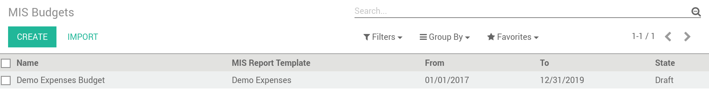
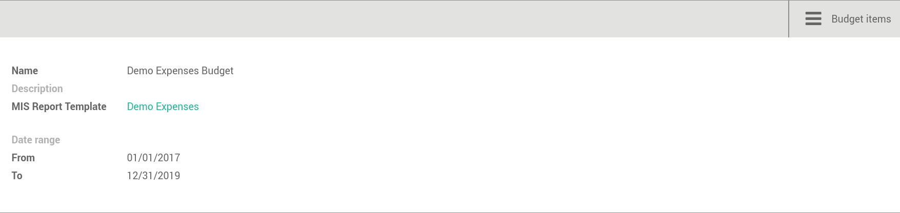
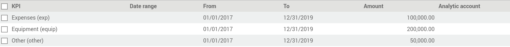
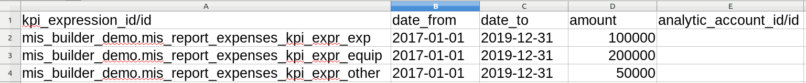

Manage your Budget
------------------
Menu accessible here: `Accounting > Reports > MIS Reports > MIS Budget`

To use this module, you first need to flag at least one KPI in a MIS Report to be
budgetable. You also need to configure the accumulation method on the KPI according
to their type.

The accumulation method determines how budgeted values spanning over a time period
are transformed to match the reporting period.

* **Sum**: values of shorter period are added, values of longest or partially overlapping
  periods are adjusted pro-rata temporis (eg monetary amount such as revenue).
* **Average**: values of included period are averaged with a pro-rata temporis weight.
  Typically used for values that do not accumulate over time (eg a number of employees).

When KPI are configured, you need to:

#. Create a budget, then
#. Click on the budget items button to create or import the budgeted amounts for all your KPI
   and time periods.
#. Finally, a column (aka period) must be added to a MIS report instance, selecting your
   newly created budget as a data source.
#. The data will be adjusted to the reporting period when displayed.
#. Columns can be compared by adding a column of type "comparison" or "sum".

Create a new budget
*******************
A budget is linked to a set of KPI created in the Report Template. A budget must be
defined for a specific period (year or month)

#. Provide a Name and Description
#. Provide the Template it applies to
#. Provide the date range. This is important because if a year is given, when the report
   must display 3 months, current figures will be provided prorata temporis.
#. Save and provide the budget Items

Fill in your Budget items
*************************
A budget contains "Budget items" (smart button on top right) which are the budget values
for a KPI and a specific data.

#. Select the KPI to be budgeted
#. Select the date range or From/To
#. provide Amount in Company currency
#. Provide the corresponding Analytic account

NB: To be noted that the budget could be prepared in Excel and easily imported
via Odoo Standard Function.

