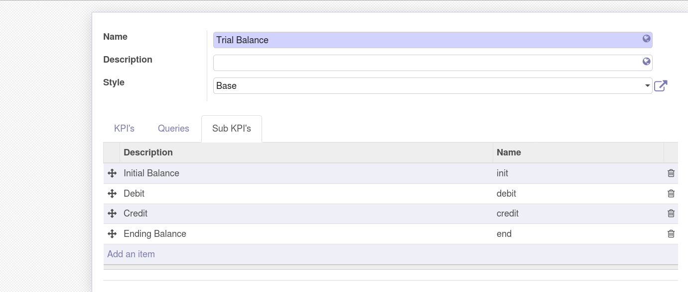
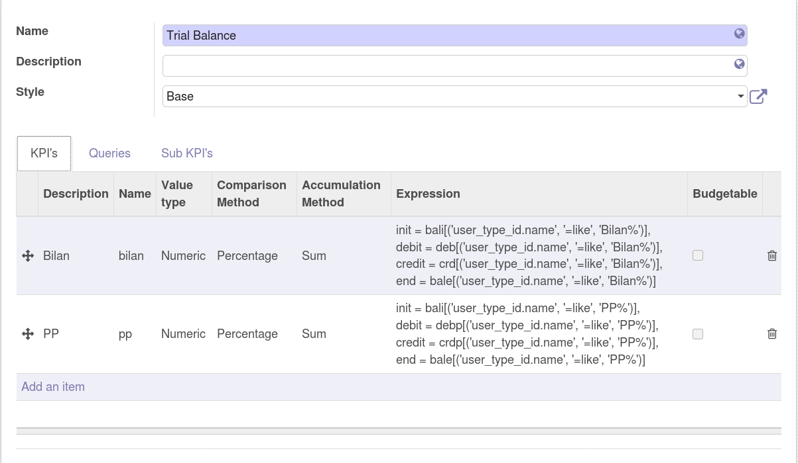
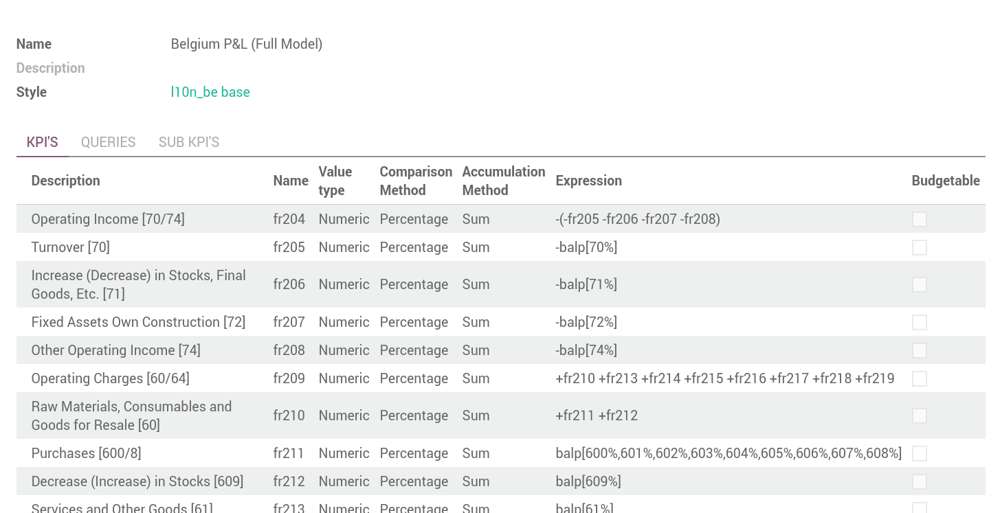
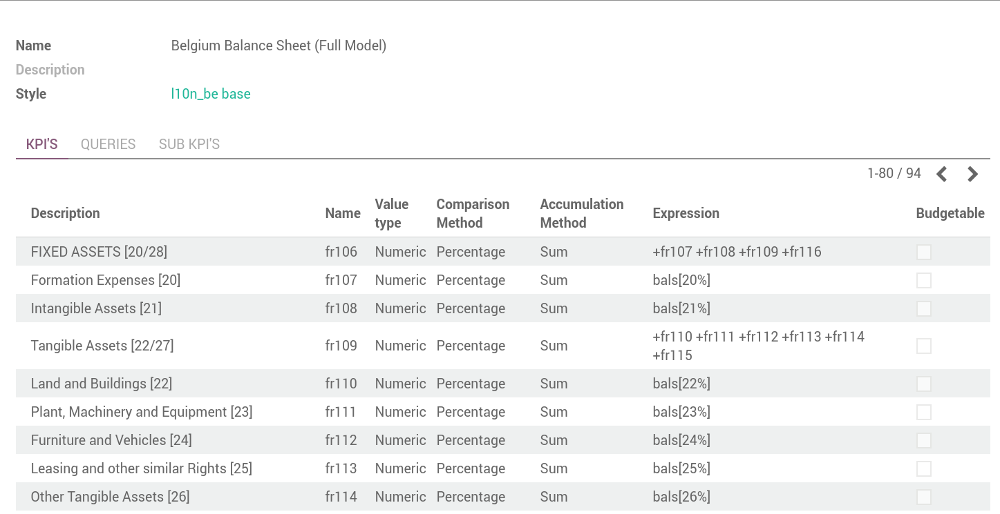
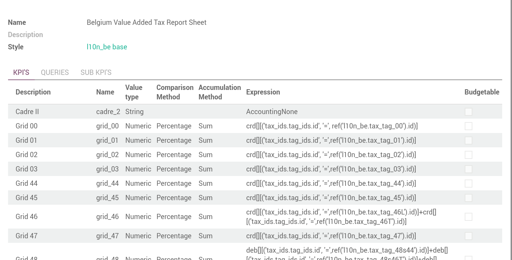
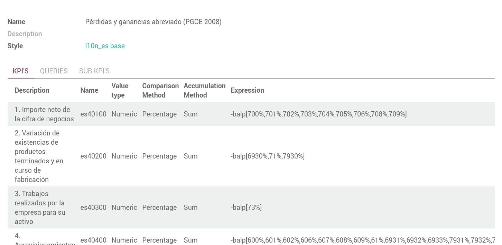

Reports Examples
----------------
To develop your own reports with MIS Builder, you can take example from the module
`mis_builder_demo <https://github.com/OCA/mis-builder/tree/10.0/mis_builder_demo>`_
or check existing official report from localization modules.

Trial Balance (sub-KPI)
***********************

Alternative Series
******************
Check the module `mis_builder_demo <https://github.com/OCA/mis-builder/tree/10.0/mis_builder_demo>`_ to see how to create specific series of data for Committed purchases not yet invoiced.

Localization
************
Multiple localization modules are currently using the MIS Builder module as a
base for their standard reporting. Examples of the reports can be studied here:

* `Belgium <https://github.com/OCA/l10n-belgium>`_
* `France <https://github.com/OCA/l10n-france>`_
* `Luxembourg <https://github.com/OCA/l10n-luxemburg>`_
* `Spain <https://github.com/CA/l10n-spain>`_

Belgium P&L
###########

Belgium Balance Sheet
#####################

Belgium VAT report
##################

.. image:: images/06.png
   :width: 1800

Spain Balance Sheet
###################
.. image:: images/07.png
   :width: 1800

Spain P&L
#########
